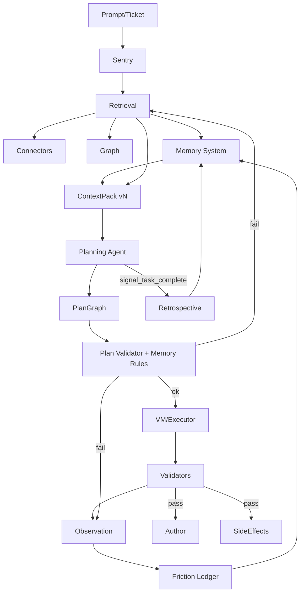

# Graph-Backed Agentic Gateway Reference Manual (ADP / MCP / No External LLMs)
[REF:DOC-OVERVIEW]

**Version:** 2.0
**Date:** 2026-02-17
**Audience:** Planning agents, pack-builders, validators, and executor agents.
**Primary use:** Canonical reference for *why* a system decision exists. Plans (PlanGraph) should cite **REF IDs** from this doc to justify choices.

---

## How to cite this doc
[REF:CITE-RULES]

- **Preferred:** cite a `REF:...` ID from the relevant bullet/paragraph.
- **Alternate:** cite line ranges using the companion JSON index.
- **Rule:** if a plan step depends on an assumption, it must cite either (a) a policy/strategy rule here, or (b) an explicit "missingness/escalation" rule here.

---

## 1) Constraints and target outcomes
[REF:SEC-1]

### 1.1 Hard constraints (ADP reality)
[REF:CONSTRAINTS]
- No external LLM services (including embeddings). [REF:NO-EMBEDDINGS]
- MCP environment; single tool `controller_turn` via NDJSON stdio (JSON-RPC 2.0, protocol `2025-11-25`). [REF:SINGLE-TOOL]
- Planner may only write to sandbox (`.ai/tmp/`) via `write_scratch_file`; **must not mutate repo** during planning. [REF:SANDBOX-ONLY]
- Agent must output a **PlanGraph** via `submit_execution_plan` before execution. [REF:PLAN-BEFORE-EXEC]
- Execution (if enabled) is mediated via VM sandbox and gated by collision guard. [REF:EXEC-GATED]
- Codebase: Angular 14 + TS/HTML; dashboard-heavy; ag-Grid; Shadow DOM via `sdf-*`; migration from `adp-*` → `sdf-*`; mixed lazy routing; module federation. [REF:CODEBASE-CONTEXT]
- Local Neo4j (bolt://127.0.0.1:7687) with lazy dynamic import for Node ≥25 compatibility. [REF:NEO4J-LOCAL]

### 1.2 Non‑negotiable principle: authority
[REF:AUTHORITY]
- The LLM is **never** the authority. Authority is:
  - Repo snapshot + graph fact plane (what exists, how it connects)
  - Policy plane (what is allowed/preferred)
  - Memory system (what was learned from friction)
  - Validators (what actually holds after change)

### 1.3 Day‑0 success criteria
[REF:DAY0-SUCCESS]
A ticket → pack → plan is "day‑0 successful" if it produces:
- An **authoritative ContextPack** with a real entrypoint + real definition, plus required proof chains (federation, UI origin) when applicable. [REF:CP-REQUIRED]
- An **evidence-linked PlanGraph** where each change step cites requirement evidence + code evidence + verification. [REF:PG-EVIDENCE-LINK]
- A deterministic **Escalate loop**: missing grounding yields structured `request_evidence_guidance`, not guessing. [REF:ESCALATE-NO-GUESS]
- A **friction-aware plan** that satisfies active memory rules (plan_rule, few_shot, strategy_signal). [REF:MEMORY-AWARE]

### 1.4 End‑state goal (complete capability)
[REF:ENDSTATE-GOAL]
End-state must support, without embeddings:
- UI feature creation (ag-Grid table flows + routing + federation) [REF:UI-FEATURE]
- API/contract feature creation (Swagger anchors → implementation mapping) [REF:API-FEATURE]
- Debugging (symptom → behavior chain → candidates) [REF:DEBUG-FEATURE]
- Migration (adp→sdf; plus "prefer sdf over native controls when possible") [REF:MIGRATION-FEATURE]
- Continuous improvement via dimensional memory system with friction-driven learning [REF:LEARNING-MEMORY]
- Session retrospective via `signal_task_complete` with friction analysis [REF:RETROSPECTIVE]

---

## 2) Glossary (terms we will not misuse)
[REF:SEC-2]

- **ContextPack (file):** TaskSpec + anchors + evidence + active strategy + policies + active memories + allowed recipes + validation plan + missingness/conflicts. [REF:DEF-CONTEXTPACK]
- **PlanGraph (file):** evidence-linked steps (change/validate/escalate/side_effect) executable without "figuring things out." [REF:DEF-PLANGRAPH]
- **Retrieval heuristics:** system-side deterministic rules used to build ContextPacks (candidate lanes, scoring, closure budgets). [REF:DEF-RETRIEVAL]
- **Strategy:** agent operating doctrine: checkpoints, escalation triggers, validation profile, and recipe preferences (stored in graph policy plane). [REF:DEF-STRATEGY]
- **Policy:** hard/soft constraints (no adp, prefer sdf, federation proof required, etc.). [REF:DEF-POLICY]
- **Recipe:** authorized transformation/workflow (codemod + parameters + invariants + verifiers). [REF:DEF-RECIPE]
- **Few-shot Example:** a mined or curated before/after payload referenced by PlanGraph and injected in `trace_symbol_graph` results. [REF:DEF-EXAMPLE]
- **Memory Record:** dimensional friction-derived knowledge (few_shot, plan_rule, strategy_signal, informational) tied to domain anchors. [REF:DEF-MEMORY]
- **Domain Anchor:** folder-based domain boundary auto-seeded from repo structure. [REF:DEF-ANCHOR]
- **Friction Ledger:** append-only JSONL log of rejection events for retrospective analysis. [REF:DEF-FRICTION]
- **Fact plane:** derived graph data from repo snapshots (rebuildable). [REF:DEF-FACT]
- **Policy plane:** versioned graph data (strategies/policies/recipes/aliases/mappings/examples). [REF:DEF-POLICY-PLANE]
- **Episodic plane:** per WorkID; append-only attempt history and observations. [REF:DEF-EPISODIC]

---

## 3) System decomposition ("boxes") and responsibilities
[REF:SEC-3]

### 3.1 Boxes
[REF:BOXES]
- **Sentry:** identity + authorization + gating (WorkID/AgentID, scope allowlist, budgets, commit gates, capability matrix). [REF:BOX-SENTRY]
- **Retrieval:** connectors + lexeme translation + candidate gen + rerank + anchor selection + closure → ContextPack. [REF:BOX-RETRIEVAL]
- **Graph:** fact/policy/episodic planes and query surface. [REF:BOX-GRAPH]
- **Plan Validator:** accepts/rejects PlanGraph with explicit rejection codes + memory rule enforcement. [REF:BOX-VALIDATOR]
- **VM/Executor:** controlled execution substrate (worktrees, codemods, patch apply, validators). [REF:BOX-VM]
- **Validators:** tests/build/a11y/cypress; shadow-aware where needed; confidence grading. [REF:BOX-VALIDATORS]
- **Observation:** run trace, attempt history, metrics, failure signatures, rejection heatmaps. [REF:BOX-OBSERVATION]
- **Memory:** dimensional memory service with friction-driven creation, domain anchors, and three enforcement mechanisms. [REF:BOX-MEMORY]
- **Author:** upsert validated learnings into policy plane (aliases, recipes, examples, strategy tuning). [REF:BOX-AUTHOR]
- **SideEffects:** Jira updates/attachments/PR creation/notifications (explicitly gated). [REF:BOX-SIDEEFFECTS]

### 3.2 Box-to-box flow diagram
[REF:FLOW-DIAGRAM]


---

## 4) Data planes, immutability, and versioning
[REF:SEC-4]

### 4.1 Plane separation (single biggest sanity saver)
[REF:PLANES]
- **Fact plane:** derived; rebuildable from snapshot. [REF:FACT-PLANE-RULE]
- **Policy plane:** curated; **append + supersede**, never overwrite. [REF:POLICY-PLANE-RULE]
- **Episodic plane:** per WorkID; append-only attempt history and observations. [REF:EPISODIC-PLANE-RULE]
- **Memory plane:** dimensional records with lifecycle states (pending → provisional → approved). [REF:MEMORY-PLANE-RULE]

### 4.2 Snapshot purity
[REF:SNAPSHOT-PURITY]
- ContextPacks and PlanGraphs must declare `repoSnapshotId`.
- A ContextPack must not mix evidence from different snapshots.
- PlanGraph targets must exist in the declared snapshot (unless `create` intent).

### 4.3 Artifact versioning (ContextPack files are physical)
[REF:PACK-VERSIONING]
- ContextPack files are immutable once written.
- New packs supersede old; old packs remain for audit/replay.
- Agent slice access should be limited to *active* pack unless replay explicitly enabled. [REF:SLICE-ACTIVE-ONLY]

---

## 5) Graph schema: minimum for day‑0, extensible for end-state
[REF:SEC-5]

### 5.1 Required proof chains (UI + federation)
[REF:PROOF-CHAINS]
UI behavior chain (often required for dashboard work): [REF:CHAIN-AGGRID]

Federation proof chain (required when federated): [REF:CHAIN-FEDERATION]


### 5.2 Fact plane node types (day‑0 minimum)
[REF:FACT-NODES]
- RepoSnapshot, File, Symbol
- AngularRoute, AngularComponent, Service
- NavTrigger
- agGridTable, ColumnDef, CellRenderer
- FederationBoundary
- WebComponentUsage (`sdf-*`, `adp-*`)
- Test (Cypress/unit), ConfigFlag (coarse)
- DomainAnchor (auto-seeded from folder structure) [REF:ANCHOR-NODE]

### 5.3 Fact plane edge types (day‑0 minimum)
[REF:FACT-EDGES]
- CONTAINS, DEFINES, IMPORTS
- ROUTES_TO, TEMPLATES, STYLES, INJECTS
- HAS_COLUMN, USES_RENDERER, TRIGGERS_NAV, TARGETS
- LOADS_REMOTE
- USES_SELECTOR
- COVERS (heuristic ok)
- APPLIES_TO (MemoryRecord → DomainAnchor) [REF:MEMORY-EDGE]

### 5.4 Policy plane entities (strategies, policies, recipes, examples)
[REF:POLICY-ENTITIES]
- PolicyRule (hard/soft) [REF:POLICYRULE]
- Strategy (agent doctrine) [REF:STRATEGY-NODE]
- ValidationProfile (required checks + confidence rules) [REF:VALIDATIONPROFILE]
- EscalationTrigger [REF:ESCALATIONTRIGGER]
- Recipe (codemod/workflow) [REF:RECIPE-NODE]
- LexemeAlias + Domain [REF:LEXEMEALIAS]
- MigrationMap (adp→sdf; coverage) [REF:MIGRATIONMAP]
- ExampleRef (preferred/anti/deprecated; last verified snapshot) [REF:EXAMPLEREF]
- SdfContractIndex (derived from `.d.ts`; versioned) [REF:SDFCONTRACTINDEX]
- RetrievalConfig + RetrievalMacro (system retrieval knobs) [REF:RETRIEVALCONFIG]
- MemoryRecord (few_shot/plan_rule/strategy_signal/informational) [REF:MEMORYRECORD]

---

## 6) Retrieval: lexical-first without embeddings (algorithmic contract)
[REF:SEC-6]

### 6.1 Lexeme model (typed lexical seeds)
[REF:LEXEME-MODEL]
Each lexeme must include: `raw`, `norm`, `kind`, `source`, `confidence`, `polarity`, `boost`, `variants[]`.
Kinds to support at minimum: ENDPOINT_PATH, ROUTE_SEGMENT, SYMBOL, SELECTOR_TAG, GRID_FIELD, UI_LABEL, CONFIG_FLAG, ERROR_STRING, DOMAIN_NOUN. [REF:LEXEME-KINDS]

### 6.2 Normalization (replaces embedding fuzz)
[REF:NORMALIZATION]
- casefold + unicode normalize
- split on whitespace/punct/path segments/camelCase/kebab/snake
- generate variants: plural/singular; kebab↔camel; selector stripping; alias expansions
- downweight Tailwind utility tokens (near-zero by default) [REF:TAILWIND-DOWNWEIGHT]

### 6.3 Candidate generation must be multi-lane
[REF:CANDIDATE-LANES]
Five mandatory retrieval lanes: [REF:FIVE-LANES]
1. **Lexical lane** — token-based text search via LexicalIndex
2. **Symbol lane** — AST symbol lookup via ts-morph IndexingService
3. **Policy lane** — active policies/strategies from graph
4. **Artifact lane** — Jira tickets, Swagger specs via connectors
5. **Episodic memory lane** — active MemoryRecords from MemoryService

### 6.4 Reranking (deterministic "score + reasons")
[REF:RERANKING]
Reranking is required to avoid:
- hub/utility gravity, and
- false focus from domain-noun collisions.
Reranking must be deterministic and explainable; store "reasons" for selected anchors in the ContextPack. [REF:RERANK-REASONS]

### 6.5 Anchor selection invariants
[REF:ANCHOR-INVARIANTS]
A pack is not ready unless it has:
- ≥1 entrypoint anchor, and
- ≥1 definition anchor.
Plus:
- federation proof chain when boundary exists, and
- origin chain (or explicit "origin unknown") for UI flows. [REF:ORIGIN-UNKNOWN-RULE]

### 6.6 Closure expansion (bounded by edge type)
[REF:CLOSURE]
Expand from anchors with explicit budgets:
- route→component unit→template/bindings→DI services
- ag-Grid chain expansion
- federation chain expansion
Include config flags encountered. Include tests with confidence grading. [REF:TEST-CONFIDENCE]

### 6.7 Search filters must be declarative (no code)
[REF:FILTER-NO-CODE]
Search `{range,file,filter}` is allowed only if `filter` is a declarative DSL or macro reference. Agent-supplied executable code in filters is forbidden. [REF:FILTER-FORBIDDEN]

---

## 7) ContextPack contract (what the planner agent receives)
[REF:SEC-7]

### 7.1 Required ContextPack sections
[REF:CP-SECTIONS]
1) Header (workId, repoSnapshotId, contextPackId/hash) [REF:CP-HEADER]
2) TaskSpec (quoted constraints + normalized AC + conflicts) [REF:TASKSPEC]
3) Active Strategy (strategyId + ContextSignature reasons) [REF:CP-STRATEGY]
4) Active Policies (hard/soft) [REF:CP-POLICIES]
5) Allowed Recipes + Examples (preferred sdf; anti adp) [REF:CP-RECIPES]
6) Anchors (entrypoint + definition + proof chains) [REF:CP-ANCHORS]
7) Evidence (snippets + refs + reasons) [REF:CP-EVIDENCE]
8) Validation plan (hooks + confidence + fallback chain) [REF:CP-VALIDATION]
9) Missingness/Conflicts (explicit gaps + recommended deltas) [REF:CP-MISSINGNESS]
10) Active Memories (dimensional records from MemoryService matching domain anchors) [REF:CP-MEMORIES]

### 7.2 Pack-ready gates (machine checkable)
[REF:CP-GATES]
- snapshot purity
- anchors present
- federation proof present when applicable
- preferred examples exclude adp guidance
- validation plan present (even fallback)
- missingness/conflicts present
- memory rules loaded for relevant domain anchors

---

## 8) Strategies (agent doctrines) as graph-native objects
[REF:SEC-8]

### 8.1 Strategy definition
[REF:STRATEGY-DEF]
A Strategy is a doctrine: checkpoints, escalation triggers, preferred recipes, and a validation profile. Strategy selection must be deterministic from ContextSignature features. [REF:STRATEGY-SELECTION]

### 8.2 ContextSignature (no embeddings)
[REF:CONTEXTSIGNATURE]
Compute simple boolean/ordinal features (8 total): [REF:CONTEXTSIGNATURE-FEATURES]
- `hasJira`, `hasSwagger`, `mentionsAgGrid`, `touchesShadowDom`
- `crossesFederationBoundary`, `migrationAdpDetected`, `contractAnchorPresent`, `testConfidenceLevel`

Computed deterministically from lexemes, artifacts, anchors, and Jira fields via `computeContextSignature()` (259 lines).

### 8.3 Strategy compliance
[REF:STRATEGY-COMPLIANCE]
PlanGraph must conform to selected strategy. Deviations require `strategyDeviationReason` + evidence. Strategy switches after failures must be triggered by explicit hard triggers (policy plane). [REF:STRATEGY-SWITCH-TRIGGERS]

### 8.4 Strategy classes (4 mandatory)
[REF:STRATEGY-CLASSES]
| Strategy ID | Selection Trigger |
|------------|-------------------|
| `ui_aggrid_feature` | `mentionsAgGrid` or UI table context |
| `api_contract_feature` | `hasSwagger` or API contract context |
| `migration_adp_to_sdf` | `migrationAdpDetected` |
| `debug_symptom_trace` | Error/symptom debugging context |

### 8.5 Memory-carried strategy signals
[REF:STRATEGY-MEMORY]
Active memories with `enforcementType: "strategy_signal"` can override ContextSignature features for specific domain anchors, influencing strategy selection without changing the deterministic selection logic. [REF:STRATEGY-SIGNAL-OVERRIDE]

---

## 9) Policies, recipes, examples, and codemods
[REF:SEC-9]

### 9.1 Policies (hard vs soft)
[REF:POLICIES]
- Hard: do not introduce `adp-*` [REF:POLICY-NO-ADP]
- Soft: prefer `sdf-*` over native controls when possible [REF:POLICY-PREFER-SDF]
- Federation proof required for execution-ready packs [REF:POLICY-FED-PROOF]
- Shadow DOM testing confidence rules [REF:POLICY-SHADOW]

### 9.2 Codemods: manifest + graph recipe nodes
[REF:CODEMODS]
Built-in AST codemods (4): [REF:BUILTIN-CODEMODS]
- `rename_identifier_in_file` — rename symbol across file
- `update_import_specifier` — update import paths
- `update_route_path_literal` — update route path strings
- `rewrite_template_tag` — rewrite Angular template tags

Custom codemod registry: [REF:CUSTOM-CODEMODS]
- Runtime registration via `registerCustomCodemod(descriptor)`
- Custom codemods follow same sandbox verification as built-in
- Registered via memory records or seed data
- `listAstCodemods()` returns both built-in and custom

Invocation must be `recipeId + validated params` (no arbitrary CLI). [REF:CODEMOD-PARAMS]

### 9.3 Recipes (2 built-in)
[REF:RECIPES]
| Recipe ID | Purpose |
|-----------|---------|
| `replace_lexeme_in_file` | Codemod-style lexeme replacement |
| `run_targeted_validation` | Targeted test/validation execution |

Recipe execution via `run_automation_recipe` emits episodic event with full provenance. [REF:RECIPE-OBS]

### 9.4 Few-shot examples without embeddings
[REF:EXAMPLES]
- Scenario A: mine existing `sdf-*` usage patterns. [REF:EX-A]
- Scenario B: mine migration diffs and mappings.json outputs. [REF:EX-B]
- Scenario C: auto-scaffold from friction — rejection patterns generate scaffolded few-shot records with `before` filled but `after` and `whyWrong` left for human review. [REF:EX-C]
- adp examples are **anti-examples/removal targets** by default. [REF:ADP-ANTI]
- Few-shot examples injected into `trace_symbol_graph` results when `enableFewShotInjection` is true. [REF:FEWSHOT-INJECTION]

---

## 10) PlanGraph acceptance checklist (validator contract)
[REF:SEC-10]

### 10.1 Envelope required (day‑0 trimmed)
[REF:PG-ENVELOPE]
Reject if missing:
- workId, agentId, runSessionId, repoSnapshotId, worktreeRoot
- contextPackRef, contextPackHash
- policyVersionSet, scopeAllowlistRef
- knowledgeStrategyId, knowledgeStrategyReasons[]
- evidencePolicy (category minima + distinct-source definition + single-source guards)
- planFingerprint, sourceTraceRefs[]
- schemaVersion

### 10.2 Per-node required fields by kind
[REF:PG-KIND-SPECIFIC]
Common (all nodes): nodeId, kind, dependsOn[], atomicityBoundary, expectedFailureSignatures[], correctionCandidateOnFail. [REF:PG-COMMON]

Change nodes require: operation, targetFile, targetSymbols[], whyThisFile, citations[], codeEvidence[], policyRefs[], verificationHooks[], escalateIf[], plus editIntent sufficient for weak executor. [REF:PG-CHANGE-REQ]

Validate nodes require: verificationHooks[], mapsToNodeIds[], successCriteria. [REF:PG-VALIDATE-REQ]

Escalate nodes require: requestedEvidence[], blockingReasons[], proposedNextStrategyId (optional). [REF:PG-ESCALATE-REQ]

Side-effect nodes require: sideEffectType, sideEffectPayloadRef, commitGateId; should depend on validate nodes. [REF:PG-SIDEEFFECT-REQ]

### 10.3 Scope and safety rules
[REF:PG-SCOPE]
- targetFile must resolve inside worktreeRoot (no path traversal).
- targetFile must be in allowlist for workId.
- targetSymbols must exist in snapshot unless create intent is explicit.
- no wildcard symbol scope.
Reject on first violation. [REF:PG-SCOPE-REJECT]

### 10.4 Evidence rules (category minima; non-gameable)
[REF:PG-EVIDENCE]
- Use category-based minima: minRequirementSources, minCodeEvidenceSources, optional minPolicySources. [REF:PG-EVIDENCE-CATS]
- Distinct-source definition must prevent gaming ("two refs to same file" ≠ two sources). [REF:PG-DISTINCT]
- For feature work: require at least one requirement citation AND one codeEvidence anchor. [REF:PG-CAT-COVERAGE]

Single-source allowance (only when allowSingleSourceWithGuard=true): [REF:PG-LOW-EVIDENCE]
- lowEvidenceGuard=true
- uncertaintyNote required
- requiresHumanReview=true

### 10.5 Memory rule enforcement
[REF:PG-MEMORY-RULES]
Active memories with `enforcementType: "plan_rule"` are enforced during plan validation: [REF:MEMORY-PLAN-RULES]
- Each memory's `planRule.condition` is checked against plan nodes
- Each `planRule.requiredSteps[]` must have a matching plan node (by kind and optional targetPattern)
- Unsatisfied rules produce `planRule.denyCode` rejection
- Results reported as `memoryRuleResults[]` in validation output

### 10.6 Atomicity rules
[REF:PG-ATOMICITY]
- One node = one cohesive concern.
- multi-file nodes must map to same concern + same acceptance goal.
- node must declare out-of-scope via atomicityBoundary.
- no mixed refactor+feature+migration unless explicitly justified. [REF:PG-NO-MIX]

### 10.7 Verification rules
[REF:PG-VERIFY]
- every change node must include ≥1 blocking verification hook
- hooks must be executable here
- hooks must map to acceptance criteria (not "run tests") [REF:PG-VERIFY-NOTGENERIC]

### 10.8 Strategy compliance and switching
[REF:PG-STRATEGY]
- node sequence must conform to knowledgeStrategyId
- deviations require deviation reason + evidence
- strategy switch allowed only via hard triggers after failure signatures [REF:PG-STRATEGY-SWITCH]

### 10.9 Rejection codes (17 total)
[REF:PG-REJECT-CODES]
| Code | Domain |
|------|--------|
| `PLAN_MISSING_REQUIRED_FIELDS` | Envelope/node completeness |
| `PLAN_SCOPE_VIOLATION` | Scope/capability gating |
| `PLAN_EVIDENCE_INSUFFICIENT` | Evidence policy |
| `PLAN_NOT_ATOMIC` | Atomicity rules |
| `PLAN_VERIFICATION_WEAK` | Verification hooks |
| `PLAN_STRATEGY_MISMATCH` | Strategy compliance |
| `PLAN_WEAK_MODEL_AMBIGUOUS` | Weak-model handoff |
| `PLAN_FEDERATION_PROOF_MISSING` | Federation proof chains [REF:RC-FED] |
| `PLAN_ORIGIN_UNKNOWN` | ag-Grid origin chain [REF:RC-ORIGIN] |
| `PLAN_POLICY_VIOLATION` | Policy rule violation [REF:RC-POLICY] |
| `PLAN_MISSING_CONTRACT_ANCHOR` | Contract anchor missing [REF:RC-CONTRACT] |
| `PLAN_VALIDATION_CONFIDENCE_TOO_LOW` | Confidence threshold [REF:RC-VALCONF] |
| `EXEC_SIDE_EFFECT_COLLISION` | Collision guard |
| `EXEC_UNGATED_SIDE_EFFECT` | Missing commit gate |
| `MEMORY_PROVISIONAL_EXPIRED` | Expired provisional memory |
| `PACK_INSUFFICIENT` | Context pack assembly failure |
| `PACK_REQUIRED_ANCHOR_UNRESOLVED` | Anchor resolution failure |

---

## 11) Observability + Memory System
[REF:SEC-11]

### 11.1 What to record (episodic plane)
[REF:OBS-RECORD]
- Input and output envelopes
- Retrieval traces
- Plan validation outcomes (including memory rule results)
- Execution outcomes
- Repeated actions and failures
- Strategy choices and switches
- Friction events (rejection code, domain, session, count)

### 11.2 Memory system (friction-driven learning)
[REF:MEMORY-SYSTEM]

#### 11.2.1 Three entry points
[REF:MEMORY-ENTRY]
1. **Friction-based** (automatic): Same rejection code hits `rejectionThreshold` (default 3) times → auto-create pending memory with scaffolded few-shot data. [REF:MEMORY-FRICTION]
2. **Human override** (file drop): JSON files in `.ai/memory/overrides/` → processed on next `submit_execution_plan`, goes straight to `approved`. [REF:MEMORY-HUMAN]
3. **Retrospective** (`signal_task_complete`): Reviews all friction data, scaffolds memory candidates from high-frequency patterns. [REF:MEMORY-RETRO]

#### 11.2.2 Dimensional model
[REF:MEMORY-DIMENSIONS]
Each memory record has:
- **WHERE**: trigger (rejection_pattern/human_override/retrospective/rule_violation/friction_signal), phase (exploration/planning/execution/retrospective), domainAnchorIds (folder-based)
- **WHAT**: enforcementType (few_shot/plan_rule/strategy_signal/informational) with type-specific payload
- **WHY**: rejectionCodes, originStrategyId, note
- **LIFECYCLE**: state (pending/provisional/approved/rejected/expired), timestamps, traceRef

#### 11.2.3 Three enforcement mechanisms
[REF:MEMORY-ENFORCEMENT]
| Mechanism | Where Enforced | How |
|-----------|---------------|-----|
| `few_shot` | `trace_symbol_graph` handler | Injected as before/after examples in results [REF:ENFORCE-FEWSHOT] |
| `plan_rule` | `planGraphValidator` | Required steps / deny conditions checked against plan nodes [REF:ENFORCE-PLANRULE] |
| `strategy_signal` | `strategySelector` | Feature flag overrides for domain-specific strategy tuning [REF:ENFORCE-STRATEGY] |

#### 11.2.4 Domain anchors (folder-based)
[REF:DOMAIN-ANCHORS]
- Auto-seeded from repo folder structure (configurable max depth, exclude patterns)
- Each folder → DomainAnchor node with parent-child `:CONTAINS` relationships
- File → anchor resolution finds most specific match and expands hierarchy
- Memories connected to anchors via `domainAnchorIds`

#### 11.2.5 Friction ledger
[REF:FRICTION-LEDGER]
Append-only JSONL at `.ai/tmp/friction-ledger.jsonl`. Records: timestamp, trigger, rejectionCodes, domainAnchorIds, memoryId, rejectionCount, resolved, strategyId, sessionId, workId.

#### 11.2.6 Memory lifecycle
[REF:MEMORY-LIFECYCLE]
```
pending → provisional → approved → retired
              ↑
        human override (skip to approved)
```
- Contest window: 48h (configurable)
- Auto-promotable types: `informational`, `strategy_signal`
- Human approval required: `plan_rule`
- Provisional expiry: 48h (configurable)

### 11.3 Session retrospective (signal_task_complete)
[REF:RETROSPECTIVE-HANDLER]
When agent calls `signal_task_complete`:
1. Generates friction digest (rejection heatmap, top signatures, hotspots, trend)
2. Reports memory status (pending/provisional/approved counts + details)
3. Computes session statistics (turns, rejections, verb distribution)
4. Generates suggestions (high-friction codes → plan_rule candidates, top signatures → few-shot candidates)
5. Transitions state to `COMPLETED`
6. `.github/copilot-instructions.md` instructs agents to call this when done

### 11.4 Promotion to policy plane (Author)
[REF:PROMOTION]
Only promote after validation passes (or explicit human approval): aliases, mappings, recipes, examples, strategy tuning. [REF:PROMOTION-GATED]

---

## 12) Verb reference (18 verbs)
[REF:SEC-12]

### 12.1 Pre-plan verbs (14, available in PLAN_REQUIRED)
[REF:VERBS-PREPLAN]
| Verb | Purpose | Required Args |
|------|---------|---------------|
| `list_available_verbs` | List available verbs for current state | — |
| `list_scoped_files` | List files in worktree scope | — |
| `list_directory_contents` | List directory entries | `targetDir` |
| `read_file_lines` | Read line range from scoped file | `targetFile` |
| `lookup_symbol_definition` | Look up symbol in AST index | `symbol` |
| `trace_symbol_graph` | Find related symbols + inject few-shots | `symbol \| targetFile \| query` |
| `search_codebase_text` | Grep text pattern across scope | `pattern` |
| `fetch_jira_ticket` | Fetch Jira ticket by key | `ticketKey` |
| `fetch_api_spec` | Fetch OpenAPI/Swagger spec | `specUrl` |
| `get_original_prompt` | Retrieve stored user prompt | — |
| `write_scratch_file` | Write temp file to scratch area | `relativePath`, `content` |
| `submit_execution_plan` | Submit PlanGraph for validation | `planGraph` |
| `request_evidence_guidance` | Signal stuck, get guidance | `blockingReasons` |
| `signal_task_complete` | Trigger session retrospective | — (optional: `summary`, `lessonsLearned`) |

### 12.2 Post-plan verbs (4 additional, available in PLAN_ACCEPTED/EXECUTION_ENABLED)
[REF:VERBS-POSTPLAN]
| Verb | Purpose | Required Args |
|------|---------|---------------|
| `apply_code_patch` | Structured code patch | `planNodeId`, `targetFile`, `edits` |
| `run_sandboxed_code` | Execute sandboxed IIFE | `planNodeId`, `code` |
| `execute_gated_side_effect` | Gated side-effect | `planNodeId`, `sideEffectType` |
| `run_automation_recipe` | Run named recipe | `recipeId`, `planNodeId`, `artifactBundleRef`, `diffSummaryRef` |

### 12.3 Budget-safe verbs (callable even when budget exceeded)
[REF:VERBS-BUDGET-SAFE]
`list_available_verbs`, `get_original_prompt`, `request_evidence_guidance`, `signal_task_complete`

---

## 13) Comprehensive gotchas (with detection + mitigation)
[REF:SEC-13]

### 13.1 Snapshot/identity gotchas
[REF:GOT-IDENTITY]
- snapshot mixing → hard fail pack [REF:GOT-SNAP]
- duplicate symbol identities → stable join keys + unify [REF:GOT-DUP]
- generated artifacts poisoning → exclude by default [REF:GOT-GEN]

### 13.2 Angular routing/nav gotchas
[REF:GOT-ROUTES]
- string-built URLs → unresolved routeRefs → escalate [REF:GOT-URL]
- guards/resolvers affect behavior → include in closure when present [REF:GOT-GUARD]

### 13.3 ag-Grid gotchas
[REF:GOT-AGGRID]
- columnDef factories/builders → index symbol refs [REF:GOT-COLDEF]
- renderer registry indirection → resolver or explicit uncertainty [REF:GOT-RENDER]
- origin missing → mark ORIGIN_UNKNOWN; bias escalate [REF:GOT-ORIGIN]

### 13.4 Federation gotchas (highest severity)
[REF:GOT-FED]
- host→remote proof missing → pack insufficient [REF:GOT-FED-MISS]
- multiple remotes plausible → ambiguity must be explicit [REF:GOT-FED-AMB]

### 13.5 Shadow DOM / sdf gotchas
[REF:GOT-SHADOW]
- tests don't pierce shadowRoot → false confidence → downgrade [REF:GOT-SHADOW-TEST]
- contract drift → stale examples → downweight; refresh [REF:GOT-CONTRACT]

### 13.6 Migration gotchas
[REF:GOT-MIGRATION]
- mappings incomplete → codemod unhandled patterns must surface [REF:GOT-MAP]
- scoped exceptions needed → encode explicitly in policy [REF:GOT-EXCEPTION]

### 13.7 Lexical-only gotchas
[REF:GOT-LEXICAL]
- vocabulary mismatch → alias expansion + negative lexemes [REF:GOT-ALIAS]
- hub bias → penalties + corroboration [REF:GOT-HUB]
- Tailwind noise → downweight [REF:GOT-TW]

### 13.8 Planning/validation gotchas
[REF:GOT-PLAN]
- plausible but wrong plan → require requirement+code evidence [REF:GOT-PLAUSIBLE]
- regeneration churn → require deltas/strategy switch [REF:GOT-CHURN]
- flaky tests → avoid promoting unstable patterns [REF:GOT-FLAKE]

### 13.9 Memory system gotchas
[REF:GOT-MEMORY]
- Scaffolded few-shots have blank `after`/`whyWrong` → human must fill before effective [REF:GOT-SCAFFOLD]
- Auto-promotion of `plan_rule` memories is blocked by default → requires human approval [REF:GOT-PLANRULE-APPROVAL]
- MCP is passive stdio → cannot push corrections mid-session; only catches patterns at retrospective [REF:GOT-PASSIVE]
- Folder-based anchors may be too coarse for cross-cutting concerns → use `anchorIncludeOverrides` [REF:GOT-ANCHOR-COARSE]

---

## 14) Evaluation harness (how you know retrieval is good)
[REF:SEC-14]

### 14.1 Golden tasks
[REF:EVAL-TASKS]
- UI table flow feature (ag-Grid click → route → detail)
- API contract change (Swagger path/schema → implementation)
- Migration slice (adp→sdf + shadow dom validation)
- Debug slice (symptom string → root cause)

### 14.2 Metrics
[REF:EVAL-METRICS]
- anchor hit rate (entrypoint+definition)
- federation proof rate
- origin chain found rate
- pack sufficiency rate (plan accepted without escalation)
- PlanGraph acceptance rate
- validator pass rate
- time-to-first-correct-plan (attempt count)
- drift alerts (stale examples/contracts)
- **friction resolution rate** (memories created vs resolved) [REF:METRIC-FRICTION]
- **memory enforcement rate** (how often memories prevent re-rejection) [REF:METRIC-MEMORY]

### 14.3 Test harness
[REF:TEST-HARNESS]
62 tests across 8 sections (58 PASS, 0 FAIL, 4 SKIP):
1. Transport Layer — protocol compliance
2. Pre-Plan Verbs — all 14 verbs
3. Plan Lifecycle — submit/validate/accept
4. Post-Plan Mutations — patch/code_run/side_effect/recipe
5. Session & Response — envelope, budget, strategy
6. Mutation Deny Paths — actionable error messages
7. Verb Descriptions — self-describing API
8. Memory System — signal_task_complete, retrospective, friction

Run: `node test-mcp-harness.mjs` from repo root.

---

## 15) File reference
[REF:SEC-15]

### Runtime files
| Path | Purpose |
|------|---------|
| `.ai/memory/records.json` | Persisted memory records |
| `.ai/memory/changelog.jsonl` | Memory state transitions |
| `.ai/memory/overrides/` | Human override drop folder |
| `.ai/tmp/friction-ledger.jsonl` | Friction event log |
| `.ai/tmp/work/{workId}/scratch/` | Scratch file area |
| `.ai/graph/seed/**/*.jsonl` | Graph seed data |
| `.ai/config/` | Layered configuration |
| `.ai/auth/` | Secrets (gitignored) |

### Documentation
| Path | Purpose |
|------|---------|
| `.ai/mcp-controller/specs/mcp_controller_full_spec.md` | Controller specification |
| `specs/graph_gateway_reference_points.md` | This reference manual |
| `.ai/how-to/memory-system.md` | Memory system how-to guide |
| `.ai/how-to/extending-codemods.md` | Custom codemod guide |
| `.github/copilot-instructions.md` | Agent instructions |

---

**End of reference manual.**
