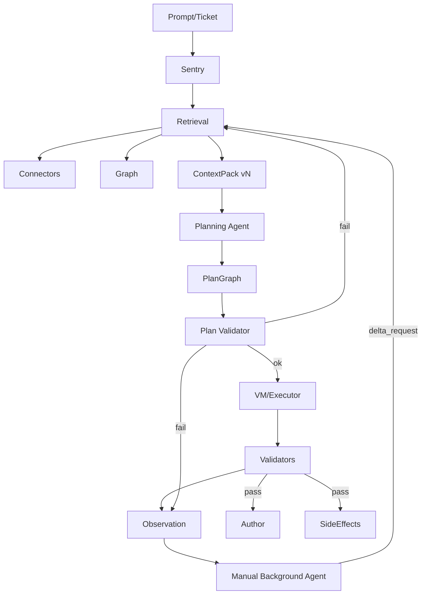
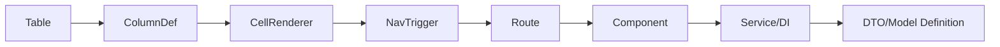
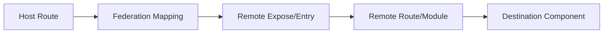

# Graph-Backed Agentic Gateway Reference Manual (ADP / MCP / No External LLMs)
[REF:DOC-OVERVIEW]

**Version:** 1.0  
**Date:** 2026-02-16  
**Audience:** Planning agents, pack-builders, validators, and executor agents.  
**Primary use:** This document is the canonical reference for *why* a system decision exists. Plans (PlanGraph) should cite **REF IDs** from this doc (or the companion line-index JSON) to justify choices.

---

## How to cite this doc
[REF:CITE-RULES]

- **Preferred:** cite a `REF:...` ID from the relevant bullet/paragraph.  
- **Alternate:** cite line ranges using the companion JSON index (generated from this markdown).  
- **Rule:** if a plan step depends on an assumption, it must cite either (a) a policy/strategy rule here, or (b) an explicit “missingness/escalation” rule here.

---

## 1) Constraints and target outcomes
[REF:SEC-1]

### 1.1 Hard constraints (ADP reality)
[REF:CONSTRAINTS]
- No external LLM services (including embeddings).  
- MCP environment; assume Copilot “tools” are OFF.  
- Planner may only write to a sandbox workspace (e.g., `.ai/tmp`) and **must not mutate repo** during planning.  
- Agent must output a **PlanGraph** before execution.  
- Execution (if enabled) is mediated via VM and gated by Sentry.  
- Codebase: Angular 14 + TS/HTML; dashboard-heavy; ag-Grid; Shadow DOM via `sdf-*`; migration from `adp-*` → `sdf-*`; mixed lazy routing; module federation trending to “fully federated/async deploy.”

### 1.2 Non‑negotiable principle: authority
[REF:AUTHORITY]
- The LLM is **never** the authority. Authority is:
  - Repo snapshot + graph fact plane (what exists, how it connects)  
  - Policy plane (what is allowed/preferred)  
  - Validators (what actually holds after change)

### 1.3 Day‑0 success criteria
[REF:DAY0-SUCCESS]
A ticket → pack → plan is “day‑0 successful” if it produces:
- An **authoritative ContextPack** with a real entrypoint + real definition, plus required proof chains (federation, UI origin) when applicable. [REF:CP-REQUIRED]  
- An **evidence-linked PlanGraph** where each change step cites requirement evidence + code evidence + verification. [REF:PG-EVIDENCE-LINK]  
- A deterministic **Escalate loop**: missing grounding yields structured Escalate requests, not guessing. [REF:ESCALATE-NO-GUESS]

### 1.4 End‑state goal (complete capability)
[REF:ENDSTATE-GOAL]
End-state must support, without embeddings:
- UI feature creation (ag-Grid table flows + routing + federation) [REF:UI-FEATURE]  
- API/contract feature creation (Swagger anchors → implementation mapping) [REF:API-FEATURE]  
- Debugging (symptom → behavior chain → candidates) [REF:DEBUG-FEATURE]  
- Migration (adp→sdf; plus “prefer sdf over native controls when possible”) [REF:MIGRATION-FEATURE]  
- Continuous improvement gated by validation (policy/strategy/recipe/example promotion only after pass) [REF:LEARNING-GATED]

---

## 2) Glossary (terms we will not misuse)
[REF:SEC-2]

- **ContextPack (file):** TaskSpec + anchors + evidence + active strategy + policies + allowed recipes + validation plan + missingness/conflicts. [REF:DEF-CONTEXTPACK]  
- **PlanGraph (file):** evidence-linked steps (change/validate/escalate/side_effect) executable without “figuring things out.” [REF:DEF-PLANGRAPH]  
- **Retrieval heuristics:** system-side deterministic rules used to build ContextPacks (candidate lanes, scoring, closure budgets). [REF:DEF-RETRIEVAL]  
- **Strategy:** agent operating doctrine: checkpoints, escalation triggers, validation profile, and recipe preferences (stored in graph policy plane). [REF:DEF-STRATEGY]  
- **Policy:** hard/soft constraints (no adp, prefer sdf, federation proof required, etc.). [REF:DEF-POLICY]  
- **Recipe:** authorized transformation/workflow (codemod + parameters + invariants + verifiers). [REF:DEF-RECIPE]  
- **Few-shot Example:** a mined or curated snippet/before-after payload referenced by PlanGraph for weak-model execution. [REF:DEF-EXAMPLE]  
- **Fact plane:** derived graph data from repo snapshots (rebuildable). [REF:DEF-FACT]  
- **Policy plane:** versioned graph data (strategies/policies/recipes/aliases/mappings/examples). [REF:DEF-POLICY-PLANE]  
- **Episodic plane:** run history (packs, plan attempts, failure signatures, delta requests). [REF:DEF-EPISODIC]

---

## 3) System decomposition (“boxes”) and responsibilities
[REF:SEC-3]

### 3.1 Boxes
[REF:BOXES]
- **Sentry:** identity + authorization + gating (WorkID/AgentID, scope allowlist, budgets, commit gates). [REF:BOX-SENTRY]  
- **Retrieval:** connectors + lexeme translation + candidate gen + rerank + anchor selection + closure → ContextPack. [REF:BOX-RETRIEVAL]  
- **Graph:** fact/policy/episodic planes and query surface. [REF:BOX-GRAPH]  
- **Plan Validator:** accepts/rejects PlanGraph with explicit rejection codes. [REF:BOX-VALIDATOR]  
- **VM/Executor:** controlled execution substrate (worktrees, codemods, patch apply, validators). [REF:BOX-VM]  
- **Validators:** tests/build/a11y/cypress; shadow-aware where needed; confidence grading. [REF:BOX-VALIDATORS]  
- **Observation:** run trace, attempt history, metrics, failure signatures. [REF:BOX-OBSERVATION]  
- **Author:** upsert validated learnings into policy plane (aliases, recipes, examples, strategy tuning). [REF:BOX-AUTHOR]  
- **SideEffects:** Jira updates/attachments/PR creation/notifications (explicitly gated). [REF:BOX-SIDEEFFECTS]  

### 3.2 Box-to-box flow diagram
[REF:FLOW-DIAGRAM]

---

## 4) Data planes, immutability, and versioning
[REF:SEC-4]

### 4.1 Plane separation (single biggest sanity saver)
[REF:PLANES]
- **Fact plane:** derived; rebuildable from snapshot. [REF:FACT-PLANE-RULE]  
- **Policy plane:** curated; **append + supersede**, never overwrite. [REF:POLICY-PLANE-RULE]  
- **Episodic plane:** per WorkID; append-only attempt history and observations. [REF:EPISODIC-PLANE-RULE]

### 4.2 Snapshot purity
[REF:SNAPSHOT-PURITY]
- ContextPacks and PlanGraphs must declare `repoSnapshotId`.  
- A ContextPack must not mix evidence from different snapshots.  
- PlanGraph targets must exist in the declared snapshot (unless `create` intent).

### 4.3 Artifact versioning (ContextPack files are physical)
[REF:PACK-VERSIONING]
- ContextPack files are immutable once written.  
- New packs supersede old; old packs remain for audit/replay.  
- Agent slice access should be limited to *active* pack unless replay explicitly enabled. [REF:SLICE-ACTIVE-ONLY]

---

## 5) Graph schema: minimum for day‑0, extensible for end-state
[REF:SEC-5]

### 5.1 Required proof chains (UI + federation)
[REF:PROOF-CHAINS]
UI behavior chain (often required for dashboard work): [REF:CHAIN-AGGRID]

Federation proof chain (required when federated): [REF:CHAIN-FEDERATION]

### 5.2 Fact plane node types (day‑0 minimum)
[REF:FACT-NODES]
- RepoSnapshot, File, Symbol  
- AngularRoute, AngularComponent, Service  
- NavTrigger  
- agGridTable, ColumnDef, CellRenderer  
- FederationBoundary  
- WebComponentUsage (`sdf-*`, `adp-*`)  
- Test (Cypress/unit), ConfigFlag (coarse)

### 5.3 Fact plane edge types (day‑0 minimum)
[REF:FACT-EDGES]
- CONTAINS, DEFINES, IMPORTS  
- ROUTES_TO, TEMPLATES, STYLES, INJECTS  
- HAS_COLUMN, USES_RENDERER, TRIGGERS_NAV, TARGETS  
- LOADS_REMOTE  
- USES_SELECTOR  
- COVERS (heuristic ok)  

### 5.4 Policy plane entities (strategies, policies, recipes, examples)
[REF:POLICY-ENTITIES]
- PolicyRule (hard/soft) [REF:POLICYRULE]  
- Strategy (agent doctrine) [REF:STRATEGY-NODE]  
- ValidationProfile (required checks + confidence rules) [REF:VALIDATIONPROFILE]  
- EscalationTrigger [REF:ESCALATIONTRIGGER]  
- Recipe (codemod/workflow) [REF:RECIPE-NODE]  
- LexemeAlias + Domain [REF:LEXEMEALIAS]  
- MigrationMap (adp→sdf; coverage) [REF:MIGRATIONMAP]  
- ExampleRef (preferred/anti/deprecated; last verified snapshot) [REF:EXAMPLEREF]  
- SdfContractIndex (derived from `.d.ts`; versioned) [REF:SDFCONTRACTINDEX]  
- RetrievalConfig + RetrievalMacro (system retrieval knobs) [REF:RETRIEVALCONFIG]

---

## 6) Retrieval: lexical-first without embeddings (algorithmic contract)
[REF:SEC-6]

### 6.1 Lexeme model (typed lexical seeds)
[REF:LEXEME-MODEL]
Each lexeme must include: `raw`, `norm`, `kind`, `source`, `confidence`, `polarity`, `boost`, `variants[]`.  
Kinds to support at minimum: ENDPOINT_PATH, ROUTE_SEGMENT, SYMBOL, SELECTOR_TAG, GRID_FIELD, UI_LABEL, CONFIG_FLAG, ERROR_STRING, DOMAIN_NOUN. [REF:LEXEME-KINDS]

### 6.2 Normalization (replaces embedding fuzz)
[REF:NORMALIZATION]
- casefold + unicode normalize  
- split on whitespace/punct/path segments/camelCase/kebab/snake  
- generate variants: plural/singular; kebab↔camel; selector stripping; alias expansions  
- downweight Tailwind utility tokens (near-zero by default) [REF:TAILWIND-DOWNWEIGHT]

### 6.3 Candidate generation must be multi-lane
[REF:CANDIDATE-LANES]
- UI destination: routes/components  
- UI origin (ag-Grid): tables/columnDefs/renderers/nav triggers  
- API: swagger endpoints/schemas → DTO/interface symbols  
- Definitions: DTO/model/store slice/row model types  
- Validation: tests + confidence + fallback recipes  

### 6.4 Reranking (deterministic “score + reasons”)
[REF:RERANKING]
Reranking is required to avoid:
- hub/utility gravity, and  
- false focus from domain-noun collisions.  
Reranking must be deterministic and explainable; store “reasons” for selected anchors in the ContextPack. [REF:RERANK-REASONS]

### 6.5 Anchor selection invariants
[REF:ANCHOR-INVARIANTS]
A pack is not ready unless it has:
- ≥1 entrypoint anchor, and  
- ≥1 definition anchor.  
Plus:
- federation proof chain when boundary exists, and  
- origin chain (or explicit “origin unknown”) for UI flows. [REF:ORIGIN-UNKNOWN-RULE]

### 6.6 Closure expansion (bounded by edge type)
[REF:CLOSURE]
Expand from anchors with explicit budgets:
- route→component unit→template/bindings→DI services  
- ag-Grid chain expansion  
- federation chain expansion  
Include config flags encountered. Include tests with confidence grading. [REF:TEST-CONFIDENCE]

### 6.7 Search filters must be declarative (no code)
[REF:FILTER-NO-CODE]
Search `{range,file,filter}` is allowed only if `filter` is a declarative DSL or macro reference. Agent-supplied executable code in filters is forbidden. [REF:FILTER-FORBIDDEN]

---

## 7) ContextPack contract (what the planner agent receives)
[REF:SEC-7]

### 7.1 Required ContextPack sections
[REF:CP-SECTIONS]
1) Header (workId, repoSnapshotId, contextPackId/hash)  
2) TaskSpec (quoted constraints + normalized AC + conflicts) [REF:TASKSPEC]  
3) Active Strategy (strategyId + ContextSignature reasons) [REF:CP-STRATEGY]  
4) Active Policies (hard/soft) [REF:CP-POLICIES]  
5) Allowed Recipes + Examples (preferred sdf; anti adp) [REF:CP-RECIPES]  
6) Anchors (entrypoint + definition + proof chains) [REF:CP-ANCHORS]  
7) Evidence (snippets + refs + reasons) [REF:CP-EVIDENCE]  
8) Validation plan (hooks + confidence + fallback chain) [REF:CP-VALIDATION]  
9) Missingness/Conflicts (explicit gaps + recommended deltas) [REF:CP-MISSINGNESS]

### 7.2 Pack-ready gates (machine checkable)
[REF:CP-GATES]
- snapshot purity  
- anchors present  
- federation proof present when applicable  
- preferred examples exclude adp guidance  
- validation plan present (even fallback)  
- missingness/conflicts present

---

## 8) Strategies (agent doctrines) as graph-native objects
[REF:SEC-8]

### 8.1 Strategy definition
[REF:STRATEGY-DEF]
A Strategy is a doctrine: checkpoints, escalation triggers, preferred recipes, and a validation profile. Strategy selection must be deterministic from ContextSignature features. [REF:STRATEGY-SELECTION]

### 8.2 ContextSignature (no embeddings)
[REF:CONTEXTSIGNATURE]
Compute simple boolean/ordinal features: has_swagger, mentions_aggrid, behind_federation_boundary, touches_shadow_dom, migration_adp_present, sdf_contract_available, test_confidence_level, task_type_guess. [REF:CONTEXTSIGNATURE-FEATURES]

### 8.3 Strategy compliance
[REF:STRATEGY-COMPLIANCE]
PlanGraph must conform to selected strategy. Deviations require `strategyDeviationReason` + evidence. Strategy switches after failures must be triggered by explicit hard triggers (policy plane). [REF:STRATEGY-SWITCH-TRIGGERS]

---

## 9) Policies, recipes, examples, and codemods
[REF:SEC-9]

### 9.1 Policies (hard vs soft)
[REF:POLICIES]
- Hard: do not introduce `adp-*` [REF:POLICY-NO-ADP]  
- Soft: prefer `sdf-*` over native controls when possible [REF:POLICY-PREFER-SDF]  
- Federation proof required for execution-ready packs [REF:POLICY-FED-PROOF]  
- Shadow DOM testing confidence rules [REF:POLICY-SHADOW]  

### 9.2 Codemods: manifest + graph recipe nodes
[REF:CODEMODS]
- Keep a **manifest** as runtime source of truth (what exists, args schema, outputs). [REF:CODEMOD-MANIFEST]  
- Represent high-impact codemods as **Recipe nodes** in the policy plane for selection/gating/observability. [REF:CODEMOD-RECIPES]  
- Codemod invocation must be `recipeId + validated params` (no arbitrary CLI). [REF:CODEMOD-PARAMS]  
- Record codemod usage episodically: recipeId, params, diffs, validator results, failure signatures. [REF:CODEMOD-OBS]

### 9.3 Few-shot examples without embeddings
[REF:EXAMPLES]
- Scenario A: mine existing `sdf-*` usage patterns. [REF:EX-A]  
- Scenario B: mine migration diffs and mappings.json outputs. [REF:EX-B]  
- Scenario C (generate+validate new examples) is not day-0; later phase. [REF:EX-C]  
- adp examples are **anti-examples/removal targets** by default, not recommended guidance. [REF:ADP-ANTI]

### 9.4 SDF non-standard contracts
[REF:SDF-CONTRACT]
Derive and persist a shared `SdfContractIndex` from `.d.ts` so planning/execution can validate legal props/events without model priors. [REF:SDF-INDEX-RULE]

### 9.5 FormBuilder normalization permissions
[REF:FORMBUILDER]
If FormBuilder decompression/normalization is allowed, encode it as a Recipe with explicit invariants (validators/updateOn/disabled semantics) and require PlanGraph steps to cite it when applied. [REF:FORMBUILDER-RECIPE]

---

## 10) PlanGraph acceptance checklist (validator contract)
[REF:SEC-10]

### 10.1 Envelope required (day‑0 trimmed)
[REF:PG-ENVELOPE]
Reject if missing:
- workId, agentId, runSessionId, repoSnapshotId, worktreeRoot  
- contextPackRef, contextPackHash  
- policyVersionSet, scopeAllowlistRef  
- knowledgeStrategyId, knowledgeStrategyReasons[]  
- evidencePolicy (category minima + distinct-source definition + single-source guards)  
- planFingerprint, sourceTraceRefs[]

`retrievalConfigId` may be optional until replay is implemented (ContextPack carries retrieval trace digest). [REF:PG-ENVELOPE-OPTIONAL]

### 10.2 Per-node required fields by kind
[REF:PG-KIND-SPECIFIC]
Common (all nodes): nodeId, kind, dependsOn[], atomicityBoundary, expectedFailureSignatures[], correctionCandidateOnFail. [REF:PG-COMMON]  

Change nodes require: operation, targetFile, targetSymbols[], whyThisFile, citations[], codeEvidence[], policyRefs[], verificationHooks[], escalateIf[], plus editIntent sufficient for weak executor. [REF:PG-CHANGE-REQ]  

Validate nodes require: verificationHooks[], mapsToNodeIds[], successCriteria. [REF:PG-VALIDATE-REQ]  

Escalate nodes require: requestedEvidence[], blockingReasons[], proposedNextStrategyId (optional). [REF:PG-ESCALATE-REQ]  

Side-effect nodes require: sideEffectType, sideEffectPayloadRef, commitGateId; should depend on validate nodes unless policy allows earlier updates. [REF:PG-SIDEEFFECT-REQ]

### 10.3 Scope and safety rules
[REF:PG-SCOPE]
- targetFile must resolve inside worktreeRoot (no path traversal).  
- targetFile must be in allowlist for workId.  
- targetSymbols must exist in snapshot unless create intent is explicit.  
- no wildcard symbol scope.  
Reject on first violation. [REF:PG-SCOPE-REJECT]

### 10.4 Evidence rules (category minima; non-gameable)
[REF:PG-EVIDENCE]
- Use category-based minima: minRequirementSources, minCodeEvidenceSources, optional minPolicySources. [REF:PG-EVIDENCE-CATS]  
- Distinct-source definition must prevent gaming (“two refs to same file” ≠ two sources). [REF:PG-DISTINCT]  
- For feature work: require at least one requirement citation AND one codeEvidence anchor. [REF:PG-CAT-COVERAGE]  

Single-source allowance (only when allowSingleSourceWithGuard=true): [REF:PG-LOW-EVIDENCE]
- lowEvidenceGuard=true  
- uncertaintyNote required  
- requiresHumanReview=true  
- additional fewShotRefs OR recipeRefs required when strategy/policy demands it [REF:PG-FEWSHOT-CONDITIONAL]

### 10.5 Atomicity rules
[REF:PG-ATOMICITY]
- One node = one cohesive concern.  
- multi-file nodes must map to same concern + same acceptance goal.  
- node must declare out-of-scope via atomicityBoundary.  
- no mixed refactor+feature+migration unless explicitly justified and policy-approved. [REF:PG-NO-MIX]

### 10.6 Verification rules
[REF:PG-VERIFY]
- every change node must include ≥1 blocking verification hook  
- hooks must be executable here  
- hooks must map to acceptance criteria (not “run tests”) [REF:PG-VERIFY-NOTGENERIC]  
Shadow DOM nuance: if node touches sdf/shadow behavior, require shadow-aware hook or mark validation confidence low + require human review/test-gen. [REF:PG-SHADOW-VERIFY]

### 10.7 Strategy compliance and switching
[REF:PG-STRATEGY]
- node sequence must conform to knowledgeStrategyId  
- deviations require deviation reason + evidence  
- strategy switch allowed only via hard triggers after failure signatures [REF:PG-STRATEGY-SWITCH]

### 10.8 Weak-model execution handoff contract
[REF:PG-WEAKMODEL]
- node must be executable without choosing additional files/symbols  
- edit intent must be sufficient and deterministic  
- escalation conditions must be explicit (no implied judgment calls) [REF:PG-NO-JUDGMENT]

### 10.9 Observability requirements
[REF:PG-OBS]
Envelope: planFingerprint + sourceTraceRefs[] required.  
Per node: expectedFailureSignatures[] required. [REF:PG-OBS-PERNODE]

### 10.10 Global rejection codes (minimum set + domain-specific)
[REF:PG-REJECT-CODES]
- PLAN_MISSING_REQUIRED_FIELDS  
- PLAN_SCOPE_VIOLATION  
- PLAN_EVIDENCE_INSUFFICIENT  
- PLAN_NOT_ATOMIC  
- PLAN_VERIFICATION_WEAK  
- PLAN_STRATEGY_MISMATCH  
- PLAN_WEAK_MODEL_AMBIGUOUS  
Plus domain failures:
- PLAN_FEDERATION_PROOF_MISSING [REF:RC-FED]  
- PLAN_ORIGIN_UNKNOWN [REF:RC-ORIGIN]  
- PLAN_POLICY_VIOLATION [REF:RC-POLICY]  
- PLAN_MISSING_CONTRACT_ANCHOR [REF:RC-CONTRACT]  
- PLAN_VALIDATION_CONFIDENCE_TOO_LOW [REF:RC-VALCONF]

---

## 11) Observability + memory + manual background agent
[REF:SEC-11]

### 11.1 What to record (episodic plane)
[REF:OBS-RECORD]
- ContextPack versions + retrieval trace (anchors, scores, macros)  
- PlanGraph attempts + rejection reasons  
- Validator outputs  
- Failure signatures (normalized) like FEDERATION_PROOF_MISSING, ORIGIN_UNKNOWN, DEFINITION_MISSING, SHADOW_TEST_WEAK, ADP_POLICY_VIOLATION. [REF:FAILSIGS]

### 11.2 Manual background agent (triggered by human)
[REF:BG-AGENT]
Reads: latest pack + plan attempts + failures + retrieval trace.  
Writes to `.ai/tmp`:
- run_digest.md (normalized explanation)  
- delta_request.json (precise changes for next pack/strategy) [REF:DELTA-REQUEST]  

Rule: no regenerate-for-free. New plan attempts must correspond to new pack/deltas/strategy switch. [REF:NO-CHURN]

### 11.3 Promotion to policy plane (Author)
[REF:PROMOTION]
Only promote after validation passes (or explicit human approval): aliases, mappings, recipes, examples, strategy tuning. [REF:PROMOTION-GATED]

---

## 12) Roadmap: day‑0 → end-state phases
[REF:SEC-12]

### 12.1 Day‑0 build order (dependency order)
[REF:ROADMAP-DAY0]
1) routes + nav triggers (including ag-Grid triggers)  
2) federation mapping/proof extraction  
3) component units + DI edges  
4) lexeme typing + candidate lanes + reranking  
5) anchor selection + closure + pack gates  
6) PlanGraph schema + validator + no-adp gate  
7) observation + failure signatures + delta requests  
8) (optional) sdf contract index derivation

### 12.2 Phase 1–4 summary
[REF:ROADMAP-PHASES]
- Phase 1: make retrieval reliably right (reduce origin unknown; prove federation)  
- Phase 2: make planning/execution cheap + reliable (recipes/examples; weak executor)  
- Phase 3: continuous learning + eval harness + drift detection  
- Phase 4: full platform (multi-agent execution, UI review, org adoption)

---

## 13) Comprehensive gotchas (with detection + mitigation)
[REF:SEC-13]

### 13.1 Snapshot/identity gotchas
[REF:GOT-IDENTITY]
- snapshot mixing → hard fail pack [REF:GOT-SNAP]  
- duplicate symbol identities → stable join keys + unify [REF:GOT-DUP]  
- generated artifacts poisoning → exclude by default [REF:GOT-GEN]

### 13.2 Angular routing/nav gotchas
[REF:GOT-ROUTES]
- string-built URLs → unresolved routeRefs → escalate [REF:GOT-URL]  
- guards/resolvers affect behavior → include in closure when present [REF:GOT-GUARD]

### 13.3 ag-Grid gotchas
[REF:GOT-AGGRID]
- columnDef factories/builders → index symbol refs [REF:GOT-COLDEF]  
- renderer registry indirection → resolver or explicit uncertainty [REF:GOT-RENDER]  
- origin missing → mark ORIGIN_UNKNOWN; bias escalate [REF:GOT-ORIGIN]

### 13.4 Federation gotchas (highest severity)
[REF:GOT-FED]
- host→remote proof missing → pack insufficient [REF:GOT-FED-MISS]  
- multiple remotes plausible → ambiguity must be explicit [REF:GOT-FED-AMB]

### 13.5 Shadow DOM / sdf gotchas
[REF:GOT-SHADOW]
- tests don’t pierce shadowRoot → false confidence → downgrade [REF:GOT-SHADOW-TEST]  
- contract drift → stale examples → downweight; refresh [REF:GOT-CONTRACT]

### 13.6 Migration gotchas
[REF:GOT-MIGRATION]
- mappings incomplete → codemod unhandled patterns must surface [REF:GOT-MAP]  
- scoped exceptions needed → encode explicitly in policy [REF:GOT-EXCEPTION]

### 13.7 Lexical-only gotchas
[REF:GOT-LEXICAL]
- vocabulary mismatch → alias expansion + negative lexemes [REF:GOT-ALIAS]  
- hub bias → penalties + corroboration [REF:GOT-HUB]  
- Tailwind noise → downweight [REF:GOT-TW]

### 13.8 Planning/validation gotchas
[REF:GOT-PLAN]
- plausible but wrong plan → require requirement+code evidence [REF:GOT-PLAUSIBLE]  
- regeneration churn → require deltas/strategy switch [REF:GOT-CHURN]  
- flaky tests → avoid promoting unstable patterns [REF:GOT-FLAKE]

---

## 14) Evaluation harness (how you know retrieval is good)
[REF:SEC-14]

### 14.1 Golden tasks
[REF:EVAL-TASKS]
- UI table flow feature (ag-Grid click → route → detail)  
- API contract change (Swagger path/schema → implementation)  
- Migration slice (adp→sdf + shadow dom validation)  
- Debug slice (symptom string → root cause)

### 14.2 Metrics
[REF:EVAL-METRICS]
- anchor hit rate (entrypoint+definition)  
- federation proof rate  
- origin chain found rate  
- pack sufficiency rate (plan accepted without escalation)  
- PlanGraph acceptance rate  
- validator pass rate  
- time-to-first-correct-plan (attempt count)  
- drift alerts (stale examples/contracts)

---

## 15) Appendix: Declarative search filter design (no code)
[REF:SEC-15]

- `filter` must be declarative: JSON predicate DSL or macro reference. [REF:APP-FILTER]  
- executable code in filters is forbidden. [REF:APP-FILTER-NO-CODE]  
- macros are versioned policy-plane objects and must be cited in ContextPack reasons. [REF:APP-MACROS]

---

**End of reference manual.**
